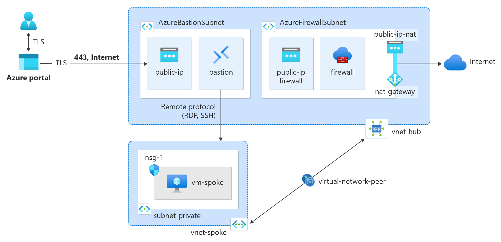

Use Terraform to deploy azure hub-spoke network and integrate a NAT gateway with an Azure Firewall

Deployment Workflow :
1- Clone the git repo

2- initialization

$ terraform init

3- Validation

$ terraform validate

4- Plan and apply

$ terraform plan -out out.plan

$ terraform apply out.plan
